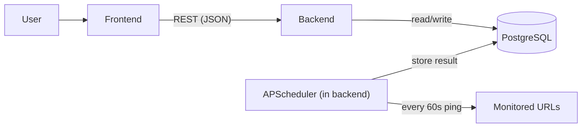

# Uptime Monitor MVP - Plan of Action

## Goal
Deliver a strict-MVP, end-to-end uptime monitor that pings a list of URLs every ~60s, stores each check (HTTP status, response time, timestamp), and renders live up/down status in a simple dashboard. Everything must come up with a single `docker compose up`.

## Chosen Stack
- Backend: Python + FastAPI (async pinging via `httpx`, scheduling via APScheduler)
- Database: PostgreSQL (own container), SQLAlchemy models
- Frontend: React + Vite, polling the API for near real-time updates
- Orchestration: Docker Compose (3 services: `db`, `backend`, `frontend`)

## Architecture



## Deliverables Checklist (mapped to the assignment)
- Backend API: register URL, periodic pinging, store status code + response time + timestamp per check
- Frontend UI: list monitored URLs with current up/down status and latest response time, auto-refreshing
- Containerization: single `docker compose up` brings up the whole stack
- Deployment Sketch: brief README note + small hypothetical IaC (Terraform) snippet
- Verification: instructions to add a healthy URL and a broken URL and observe up/down
- Repo structure: `/backend`, `/frontend`, `docker-compose.yml`
- AI Collaboration Log: `AI_LOG.md` (tech stack, prompts that shipped it, course corrections)
- README: 1-line setup, testing steps, deployment sketch

## Repository Structure
```
Uptime Monitor/
  backend/
    app/
      main.py          # FastAPI app + routes + CORS
      models.py        # SQLAlchemy: Monitor, HealthCheck
      schemas.py       # Pydantic request/response models
      database.py      # engine, session, init
      checker.py       # async ping logic (httpx)
      scheduler.py     # APScheduler job: ping all monitors every 60s
    requirements.txt
    Dockerfile
  frontend/
    src/
      App.jsx          # dashboard: table of monitors + status + latency
      api.js           # fetch helpers
      main.jsx
      styles.css
    index.html
    package.json
    vite.config.js
    Dockerfile
    nginx.conf         # serve built static assets + proxy /api to backend
  docker-compose.yml
  README.md
  AI_LOG.md
  .env.example
  .gitignore
```

## Backend Design
- Data model:
  - `Monitor`: id, url, name (optional), created_at
  - `HealthCheck`: id, monitor_id (FK), status_code, response_time_ms, is_up, checked_at
- Endpoints:
  - `POST /api/monitors` - register a URL
  - `GET /api/monitors` - list monitors with latest check (status, latency, up/down, last checked)
  - `GET /api/monitors/{id}/history` - recent checks for a monitor (supports the dashboard detail/history)
  - `DELETE /api/monitors/{id}` - remove a monitor (convenience for testing)
  - `GET /health` - liveness for compose healthcheck
- Pinging: `httpx.AsyncClient` GET with a strict timeout (~10s). `is_up` = reachable AND status < 400. Record measured latency in ms; on timeout/connection error store `status_code=null`, `is_up=false`. One slow/hanging URL must never stall the batch (per-request timeout + concurrent gather).
- Scheduler: APScheduler interval job every 60s pings all monitors concurrently and inserts `HealthCheck` rows. Also do an immediate check when a monitor is first registered so the UI shows state quickly.
- DB startup: create tables on boot; retry connection until Postgres is ready.

## Frontend Design
- Single dashboard page: table of monitors showing name/URL, up/down badge, latest response time (ms), last checked time (with a relative "x seconds ago" so live updates are visible).
- Surface the down reason where possible (timeout vs connection failed vs HTTP error) instead of a bare down flag.
- Form to add a new URL (calls `POST /api/monitors`).
- Delete button per row.
- Auto-refresh via polling every ~10s (simple, reliable for MVP).
- Served in production via nginx that also proxies `/api` to the backend service.

## Containerization
- `docker-compose.yml` with:
  - `db`: `postgres:16`, volume for persistence, healthcheck
  - `backend`: builds `/backend`, waits for `db` healthy, exposes `8000`
  - `frontend`: builds `/frontend`, nginx serving static build, exposes `8080`, proxies to backend
- `.env.example` for DB creds / API URL; sensible defaults baked in so `docker compose up` works with zero config.

## Documentation Deliverables
- `README.md`:
  - 1-line setup: `docker compose up --build`
  - Access URLs (frontend `http://localhost:8080`, API docs `http://localhost:8000/docs`)
  - Testing steps: add `https://example.com` (shows UP) and `https://this-domain-does-not-exist.invalid` or `http://localhost:9999` (shows DOWN), wait for next check / see immediate check
  - Deployment sketch: short note + hypothetical Terraform snippet (cloud container service + managed Postgres + load balancer), explicitly noting the scheduler must run as a single always-on task to avoid duplicate pings
- `AI_LOG.md` (the graded centerpiece; captured live as we build, not fabricated):
  - AI Tech Stack (Cursor + underlying LLM)
  - The prompts that shipped it (backend framework + frontend UI generation)
  - Course corrections (a real bad-code/hallucination example and the fix)

## Verification Criteria (definition of done)
- `docker compose up --build` starts all three services cleanly from scratch
- Adding `https://example.com` results in an UP row with a numeric latency
- Adding an invalid/unreachable URL results in a DOWN row
- Dashboard reflects new checks over time without manual page reload
- README steps reproduce the up/down demo; repo structure and both docs present

## Notes / Assumptions
- Polling (not WebSockets) for the UI - simplest reliable approach for MVP "real-time".
- Check interval fixed at 60s (assignment says "every minute or so"); trivially configurable via env.
- No auth (out of scope for MVP per assignment).
