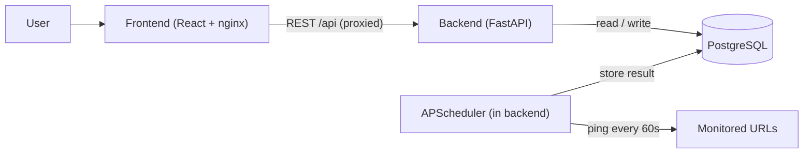
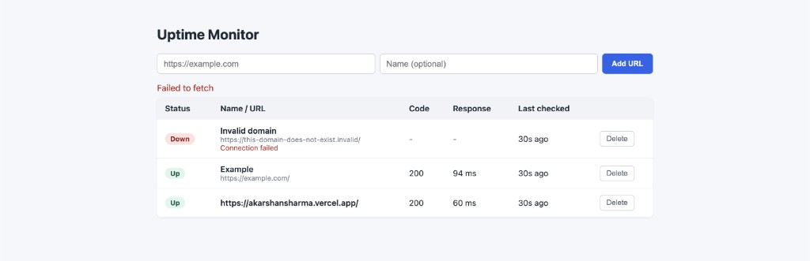
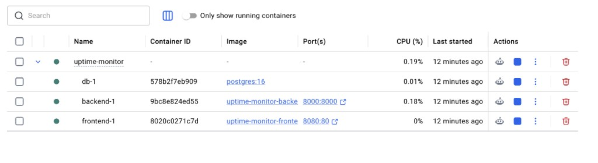

# Uptime Monitor

A lightweight, full-stack uptime monitor. It periodically pings a list of registered URLs, records the HTTP status code, response time, and timestamp of every check, and shows each URL's live up/down status on a simple dashboard.

The whole stack (database, API, dashboard) comes up with a single `docker compose up` command.

## Architecture



- **Backend** (`/backend`): FastAPI. Exposes the monitor API and runs an APScheduler job that pings every registered URL on an interval and stores each result. Pings use `httpx` with a strict per-request timeout so one slow URL cannot stall the batch.
- **Frontend** (`/frontend`): React + Vite, built to static files and served by nginx. nginx also proxies `/api` to the backend. The dashboard polls the API every 10s for near real-time updates.
- **Database**: PostgreSQL, with a persistent named volume.

## Screenshots

The dashboard, showing an up site, a down site with its failure reason, and live response times:



The full stack running locally under Docker Compose (`db`, `backend`, `frontend`):



## Prerequisites

- [Docker](https://docs.docker.com/get-docker/) and Docker Compose v2 (bundled with Docker Desktop).

## Quick start (one command)

```bash
docker compose up --build
```

Then open:

| Service        | URL                             |
| -------------- | ------------------------------- |
| Dashboard (UI) | http://localhost:8080           |
| API docs       | http://localhost:8000/docs      |
| API health     | http://localhost:8000/health    |

To stop: `Ctrl+C`, then `docker compose down` (add `-v` to also wipe the database volume).

## Verifying up/down detection

This is the exact test to confirm the monitor detects both states.

1. Start the stack: `docker compose up --build` and open the dashboard at http://localhost:8080.
2. **Add a healthy URL.** In the form, enter `https://example.com` and click **Add URL**.
   - A row appears. Within a moment (an immediate check runs on registration) its status becomes **Up**, with an HTTP code (`200`) and a response time in ms.
3. **Add a broken URL.** Enter one of:
   - `https://this-domain-does-not-exist.invalid` (DNS failure), or
   - `http://localhost:9999` (nothing listening on that port).
   - Its row shows **Down** with a reason such as `Connection failed` or `Request timed out`, and no response time.
4. **Watch it stay live.** The dashboard auto-refreshes every 10s, and the backend re-checks every URL every 60s. The "Last checked" column updates ("just now", "12s ago", ...). Delete a monitor with the **Delete** button.

### Verify via the API (optional)

```bash
# Register a healthy URL
curl -X POST http://localhost:8000/api/monitors \
  -H "Content-Type: application/json" \
  -d '{"url": "https://example.com", "name": "Example"}'

# Register a broken URL
curl -X POST http://localhost:8000/api/monitors \
  -H "Content-Type: application/json" \
  -d '{"url": "http://localhost:9999"}'

# List monitors with their latest check
curl http://localhost:8000/api/monitors
```

## API

| Method   | Path                          | Description                                   |
| -------- | ----------------------------- | --------------------------------------------- |
| `POST`   | `/api/monitors`               | Register a URL (runs an immediate check).     |
| `GET`    | `/api/monitors`               | List monitors, each with its latest check.    |
| `GET`    | `/api/monitors/{id}/history`  | Recent checks for a monitor.                  |
| `DELETE` | `/api/monitors/{id}`          | Remove a monitor and its checks.              |
| `GET`    | `/health`                     | Liveness probe.                               |

## Configuration

Compose works out-of-the-box with sensible defaults; no `.env` is required. To override, copy `.env.example` to `.env`:

| Variable                 | Default  | Description                          |
| ------------------------ | -------- | ------------------------------------ |
| `POSTGRES_USER`          | `uptime` | Database user.                       |
| `POSTGRES_PASSWORD`      | `uptime` | Database password.                   |
| `POSTGRES_DB`            | `uptime` | Database name.                       |
| `CHECK_INTERVAL_SECONDS` | `60`     | How often every URL is re-checked.   |

## Project structure

```
.
├── backend/            # FastAPI API + pinging scheduler
│   ├── app/
│   │   ├── main.py     # routes + app lifespan
│   │   ├── models.py   # SQLAlchemy models
│   │   ├── schemas.py  # Pydantic schemas
│   │   ├── database.py # engine/session + startup retry
│   │   ├── checker.py  # async URL check logic
│   │   └── scheduler.py# periodic + on-register checks
│   ├── requirements.txt
│   └── Dockerfile
├── frontend/           # React + Vite dashboard, served by nginx
│   ├── src/
│   ├── nginx.conf      # serves static build + proxies /api
│   └── Dockerfile
├── docker-compose.yml  # db + backend + frontend
├── .env.example
├── AI_LOG.md           # AI collaboration log
└── PLAN.md             # plan of action
```

## Deployment sketch (hypothetical)

This is a brief cloud topology, not a production-hardened setup. Target: AWS.

- **Frontend**: build the static bundle and serve it from **S3 + CloudFront** (or an ECS/Fargate nginx task).
- **Backend**: containerized on **ECS Fargate** behind an **Application Load Balancer**.
- **Database**: **Amazon RDS for PostgreSQL**.
- **Important topology note**: the periodic pinging runs *inside* the backend via APScheduler. To avoid duplicate checks, the scheduler must run as a **single always-on task** (one backend replica dedicated to scheduling, or the job extracted into a separate single-instance worker / EventBridge-triggered task). Naively scaling the backend to N replicas would produce N pings per interval.

A minimal, illustrative Terraform skeleton (details omitted):

```hcl
resource "aws_db_instance" "uptime" {
  engine         = "postgres"
  engine_version = "16"
  instance_class = "db.t3.micro"
  db_name        = "uptime"
  username       = var.db_user
  password       = var.db_password
  allocated_storage = 20
}

resource "aws_ecs_cluster" "uptime" {
  name = "uptime-monitor"
}

# Backend service (single replica so the scheduler runs once).
resource "aws_ecs_service" "backend" {
  name            = "backend"
  cluster         = aws_ecs_cluster.uptime.id
  task_definition = aws_ecs_task_definition.backend.arn
  desired_count   = 1
  launch_type     = "FARGATE"
  # ... networking + load_balancer wiring ...
}

# Frontend static assets.
resource "aws_s3_bucket" "frontend" {
  bucket = "uptime-monitor-frontend"
}

resource "aws_cloudfront_distribution" "frontend" {
  # ... origin = S3 bucket, default_root_object = "index.html" ...
}
```

## AI collaboration

I built this with an AI assistant (Cursor + Claude), setting the plan, architecture, and workflow while it handled a lot of the implementation under my direction. The tools, the actual prompts, and the course corrections along the way are written up in [AI_LOG.md](AI_LOG.md).
